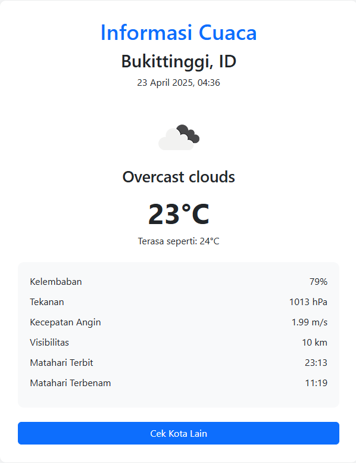

## Aplikasi Cek Cuaca

Aplikasi web sederhana untuk mengecek informasi cuaca berdasarkan nama kota menggunakan Laravel 12 dan OpenWeather API. Aplikasi ini memungkinkan pengguna untuk:

- Mencari informasi cuaca dengan memasukkan nama kota
- Melihat detail cuaca seperti suhu, kelembaban, tekanan udara, kecepatan angin, dll.
- Melihat icon cuaca sesuai dengan kondisi cuaca saat ini

## Teknologi yang Digunakan

- Laravel 12
- OpenWeather API
- Bootstrap 5
- Guzzle HTTP Client

## Instalasi

1. Clone repository ini
   ```bash
   git clone https://github.com/drenzzz/weather-app.git
   cd weather-app
   ```

2. Install dependensi
   ```bash
   composer install
   ```

3. Salin file .env.example menjadi .env
   ```bash
   cp .env.example .env
   ```

4. Generate application key
   ```bash
   php artisan key:generate
   ```

5. Tambahkan API key OpenWeather ke file .env
   ```
   OPENWEATHER_API_KEY=your_api_key_here
   ```

6. Jalankan server development
   ```bash
   php artisan serve
   ```

7. Akses aplikasi di browser melalui URL: `http://localhost:8000/weather`

## Fitur

- **Pencarian Kota**: Form input untuk memasukkan nama kota
- **Tampilan Detail**: Menampilkan informasi cuaca lengkap termasuk:
  - Suhu saat ini dan suhu yang terasa
  - Deskripsi cuaca dengan icon
  - Kelembaban dan tekanan udara
  - Kecepatan angin
  - Waktu matahari terbit dan terbenam
  - Visibilitas

## Implementasi API

Aplikasi ini menggunakan endpoint API dari OpenWeather:
- Endpoint: `https://api.openweathermap.org/data/2.5/weather`
- Parameter:
  - `q`: Nama kota
  - `appid`: API key
  - `units`: Satuan suhu (metric untuk Celsius)

## Screenshots

### Halaman Hasil Cuaca



## Author

Drenzzz a.k.a Muhammad Naufal Nazya Azzharif
